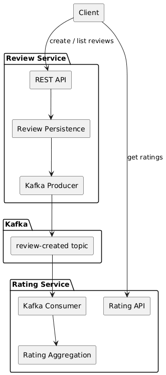

## Project Overview

This repository contains a **Java 21 / Spring Boot backend system** that models a **restaurant reviews and ratings**
domain.

The project is designed to demonstrate:

* clear separation of responsibilities
* service-level data ownership
* event-driven communication
* correct handling of concurrent writes
* clean layering and testability

The system is composed of multiple Spring Boot services that communicate through **Apache Kafka**, persist data in **PostgreSQL**, and optionally use **Redis** for read optimization. The focus is on architectural correctness, clarity,
and realistic backend design rather than feature completeness.

---

## Modules and Responsibilities

### `review-service` (Spring Boot service)

**Responsibility**

* Owns the **review write model**:

  * creates and stores individual reviews
  * exposes REST APIs for creating and listing reviews
* Publishes an event after a review is successfully persisted:

  * `ReviewCreatedEvent` → Kafka

**Data ownership**

* Owns its own PostgreSQL database/schema containing `reviews`.

**Key boundaries**

* Does not compute restaurant rating aggregates.
* Emits events so other services can build projections.

---

### `rating-service` (Spring Boot service)

**Responsibility**

* Owns the **rating read model** (aggregated data):

  * consumes `ReviewCreatedEvent`
  * updates rating aggregates per restaurant (sum/count/avg)
  * exposes REST APIs to retrieve ratings (single + batch)
* Uses Redis as an optional cache to optimize reads.

**Data ownership**

* Owns its own PostgreSQL database/schema containing `restaurant_ratings` (aggregates only).

**Key boundaries**

* Does not access the `review-service` database.
* Maintains aggregates via events and atomic DB operations.

---

## Design Decisions and Trade-offs

### Database per Service

**Decision**
Each service owns its own database schema and tables.
No service reads or writes another service’s database.

**Why**

* Enforces clear ownership boundaries.
* Prevents hidden coupling through shared persistence.
* Allows each service to evolve its schema independently.

**Trade-offs**

* Some data is "duplicated" across services (e.g. rating aggregates derived from reviews).

This is an intentional trade-off to favor **service autonomy over query convenience**.

---

### Event-driven aggregation for ratings

**Decision**
The `rating-service` builds and maintains rating aggregates by consuming review events from Kafka instead of querying the reviews database.

**Why**

* Avoids synchronous calls between services for write paths.
* Enables scalable fan-out: multiple consumers can process different restaurants in parallel.
* Keeps write traffic isolated to the owning service.

**Trade-offs**

* Ratings are **eventually consistent**: a newly created review may not immediately be reflected in the rating.
* Requires careful handling of idempotency and ordering (addressed via Kafka keys and atomic DB operations).

This trade-off prioritizes **decoupling and scalability** over immediate consistency.

---

### Redis as best-effort cache (not a source of truth)

**Decision**
Redis is used only as a read optimization layer in the `rating-service`.
The database remains the single source of truth.

**Why**

* Improves latency for hot reads (e.g. restaurant listings).
* Keeps the system correct even if Redis is unavailable or restarted.
* Simplifies recovery: cache can always be rebuilt from the database.

**Trade-offs**

* Cache misses or invalidations can temporarily increase database load.
* Slightly more logic is required to keep cache entries reasonably fresh.

This approach favors **correctness and resilience** over aggressive caching.

---

### No Debezium / CDC-based propagation

**Decision**
Changes are published explicitly by the application logic instead of using Change Data Capture (Debezium).

**Why**

* Keeps data flow explicit and easier to reason about.
* Avoids introducing additional infrastructure and operational complexity.
* Makes the write → event → projection flow visible at the application level.

**Trade-offs**

* Developers must remember to publish events when state changes.
* Requires discipline to keep event emission consistent with persistence.

For a production ready project, CDC should be considered.

---

## Simplified Architecture Diagram (UML)

This diagram shows only the **core runtime flow** between client, services, and Kafka.

